# PRAKTIKUM 2

Data Model Mapping

Mahasiswa (nim, nama, jenis_kelamin, tgl_lahir, jalan, kota, kodepos, no_hp, kd_ds)

Dosen (kd_ds, nama)

Matakuliah (kd_mk, nama, sks)

JadwalMengajar (kd_ds, kd_mk, hari, jam, ruang)

KRSMahasiswa (nim, kd_mk, kd_ds, semester, nilai)

# Tugas Praktikum

• Buat DDL Script berdasarkan skema ERD tersebut diatas.

• Jalankan script DDL tersebut pada DBMS MySQL.

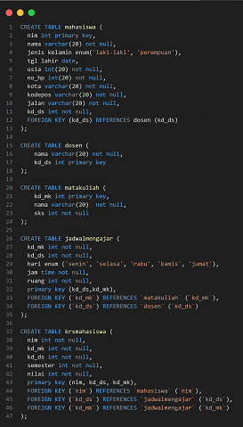

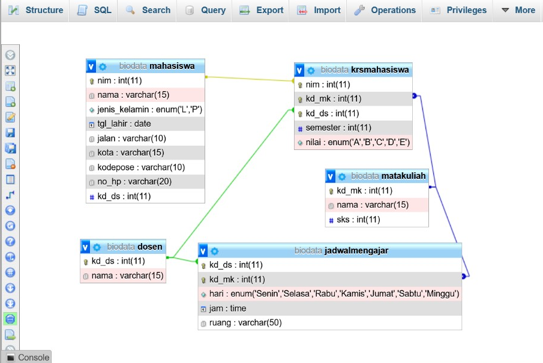

# Tugas Praktikum

- Menambahkan Data Pada Table Sebanyak 5 Record Data Dan Menampilkan Semua isi Data

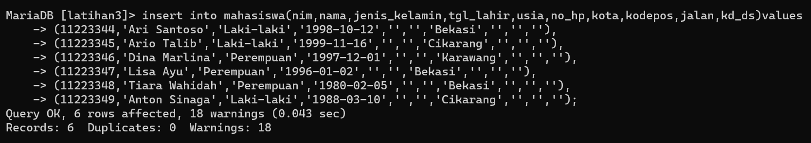

- Menampilkan semua isi tabel

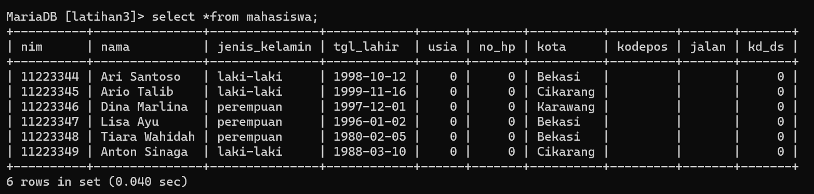

- Ubah data tanggal lahir mahasiswa yang bernama Ari menjadi: 1979-08-31!

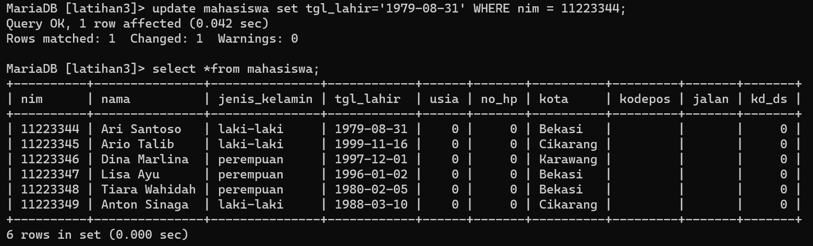

- Tampilkan satu baris / record data yang telah diubah tadi yaitu record dengan nama Ari saja!

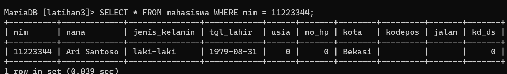

- Hapus Mahasiswa yang bernama Dina!

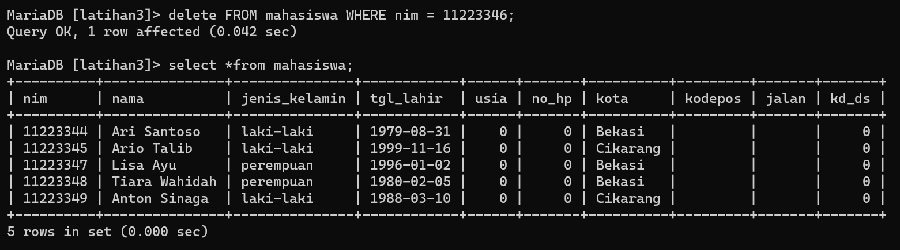

- Tampilkan record atau data yang tanggal kelahirannya lebih dari atau sama dengan 1996-1-2!

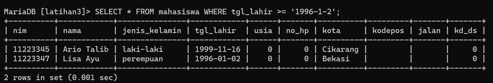

- Tampilkan semua Mahasiswa yang berasal dari Bekasi dan berjenis kelamin perempuan!

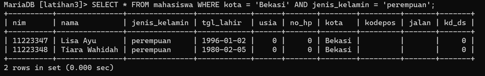

- Tampilkan semua Mahasiswa yang berasal dari Bekasi dengan kelamin laki-laki atau
Mahasiswa yang berumur lebih dari 22 tahun dengan kelamin wanita!

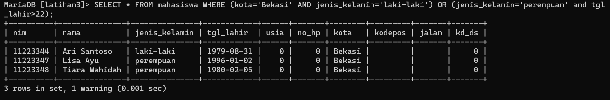

- Tampilkan data nama dan alamat mahasiswa saja dari tabel tersebut

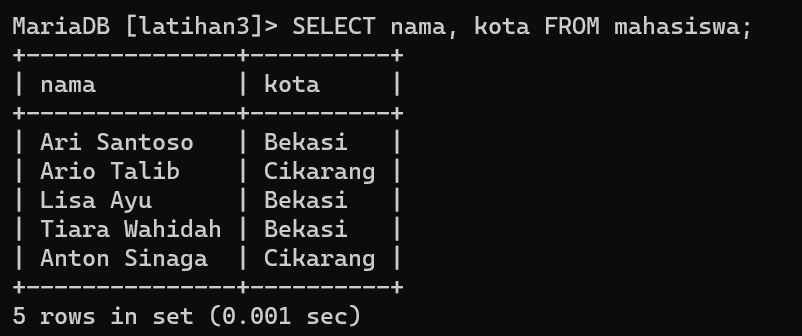

- Tampilkan data mahasiswa terurut berdasarkan nama

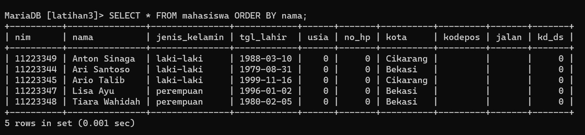

# Evaluasi dan Pertanyaan

-  Apa bedanya penggunaan BETWEEN dan penggunaan operator >= dan <= ?

-  (misal: tgl_lahir BETWEEN '1990-10-10' AND '1992-10-11')

- (misal: tgl_lahir >= '1990-10-10' AND tgl_lahir <= '1992-10-11')

- Berikan kesimpulan anda!

# JAWABAN

- Kedua cara penggunaan yang disebutkan yaitu BETWEEN dan operator >= dan <=, keduanya 
digunakan untuk menentukan kriteria pencarian dalam sebuah query di MySQL. Namun, 
terdapat perbedaan dalam cara penggunaannya.

- Penggunaan BETWEEN digunakan untuk menentukan kisaran nilai dalam sebuah kolom. 
Dalam contoh di atas, tgl_lahir BETWEEN '1990-10-10' AND '1992-10-11' menunjukkan 
pencarian data dengan tanggal lahir yang berada di antara rentang waktu tersebut, yaitu dari 
tanggal 10 Oktober 1990 hingga 11 Oktober 1992.

- Sementara penggunaan operator >= dan <= digunakan untuk menentukan kriteria pencarian 
dengan batas atas dan batas bawah. Dalam contoh di atas, tgl_lahir >= '1990-10-10' AND 
tgl_lahir <= '1992-10-11' menunjukkan pencarian data dengan tanggal lahir yang lebih besar 
atau sama dengan tanggal 10 Oktober 1990 dan lebih kecil atau sama dengan tanggal 11 Oktober 
  1992.

- Kesimpulan: Kita dapat menentukan kedua cara kriteria pencarian dalam query di MySQL.
Kemudian, Ketika kita ingin mencari data dalam rentang nilai tertentu, lebih baik menggunakan
BETWEEN, sedangkan jika Anda ingin menentukan batas atas dan batas bawah dalam kriteria
pencarian, lebih baik menggunakan operator >= dan <=. Pilihan antara keduanya tergantung pada 
kebutuhan yang spesifik dalam query yang sedang dibuat
